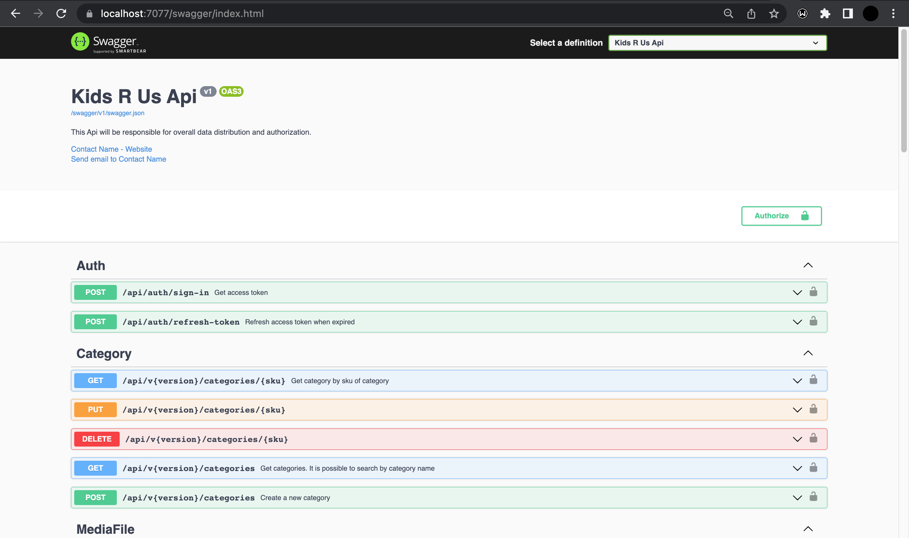
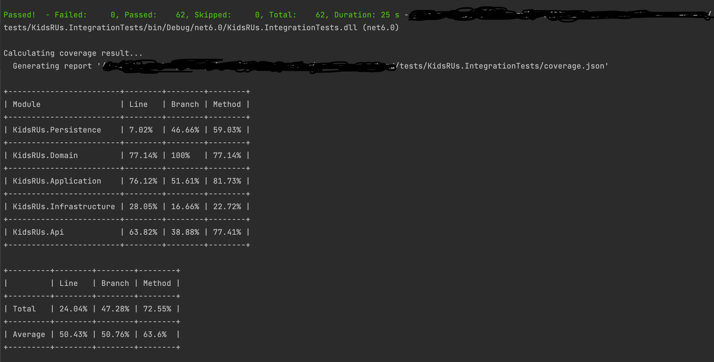

## E-commerce
 
API RESTful de un e-commerce.

Stack:
- .NET 6
- ASP NET Web API
- Entity Framework Core
- SQLite
- JWT
- Swagger
- xUnit

## Funcionalidades requeridas

- Sistema de autorización: cada request debe contener un token que identifique al usuario que está accediendo al endpoint. Este token debe ser único para ese usuario y debe tener una vigencia máxima de 30 minutos.
- CRUD de productos. Todos los usuarios pueden ver productos por su sku (identificador) pero solo los administradores y editores pueden crear, editar y eliminar artículos, el resto de los usuarios solo pueden consultar. Cada producto debe tener:
  * Nombre o título
  * Precio.
  * Cantidad en stock.
  * Categoría.
  * Tags.
  * Descripción.
  * Información adicional.
  * Valoración.
  * Sku (identificador único).
  * Imágenes asociadas (solo urls).
- Endpoint que entregue resultados de una búsqueda enviando cualquiera de las características del producto, una o varias (permitir paginación en base de 10 resultados). Si no se envía ninguna característica el resultado debe ser la lista de artículos paginada.
- Endpoint que entregue sólo la cantidad de resultados de una búsqueda enviando cualquiera de las características del producto.
- Endpoint que permita “vender” un artículo. Esta funcionalidad debe eliminar un (1) artículo del stock. No se puede vender más de un (1) tipo de artículo a la vez y no se puede vender más de un (1) artículo del mismo tipo a la vez.
- Endpoint que permita mostrar la lista de artículos vendidos.
- Endpoint que permita mostrar la ganancia total.
- Endpoint que permita mostrar los artículos que no tienen stock en el almacén.

## Funcionalidades agregadas
- CRUD de categorías.
- El Listado de categorías tiene paginado (la paginacíon por defecto es de 10) y un campo (opcional) 'Search' que busca coincidencia en el nombre de la categoría.
- El Listado de productos sin stock tiene paginado (la paginacíon por defecto es de 10) y un campo (opcional) 'Search' que busca coincidencia en el nombre y descripcíon del producto.
- El Listado de productos vendidos tiene paginado (la paginacíon por defecto es de 10) y un campo (opcional) 'Search' que busca coincidencia en el nombre y descripcíon del producto.
- Enpoint para agregar stock de un producto existente.
- Al vender un producto se guarda la fecha de venta.
- Al solicitar la ganancia total es posible pasarle un intervalo de fechas para saber la ganancia es ese período de tiempo.

## Requerimientos

- .NET 6 (6.0.301 o superior)


## Instalación

##### Instalar SDK .NET 6 (6.0.301 o superior). [Download SDK .NET 6.0](https://dotnet.microsoft.com/en-us/download/dotnet/6.0)

#
##### Comprobar la instalación de SDK .NET 6

```bash
$ dotnet --list-sdks
```

```
3.1.414 [/usr/local/share/dotnet/sdk]
3.1.416 [/usr/local/share/dotnet/sdk]
3.1.420 [/usr/local/share/dotnet/sdk]
5.0.402 [/usr/local/share/dotnet/sdk]
5.0.404 [/usr/local/share/dotnet/sdk]
6.0.101 [/usr/local/share/dotnet/sdk]
6.0.200 [/usr/local/share/dotnet/sdk]
6.0.201 [/usr/local/share/dotnet/sdk]
6.0.300 [/usr/local/share/dotnet/sdk]
6.0.301 [/usr/local/share/dotnet/sdk]
```

#
#### Instalar Entity Framework Core 6
```bash
$ dotnet tool install --global dotnet-ef
```

#
##### Comprobar la instalación de Entity Framework Core 6

```bash
$ dotnet ef
```

```

                     _/\__       
               ---==/    \\      
         ___  ___   |.    \|\    
        | __|| __|  |  )   \\\   
        | _| | _|   \_/ |  //|\\ 
        |___||_|       /   \\\/\\

Entity Framework Core .NET Command-line Tools 6.0.7

Usage: dotnet ef [options] [command]

Options:
  --version        Show version information
  -h|--help        Show help information
  -v|--verbose     Show verbose output.
  --no-color       Don't colorize output.
  --prefix-output  Prefix output with level.

Commands:
  database    Commands to manage the database.
  dbcontext   Commands to manage DbContext types.
  migrations  Commands to manage migrations.

Use "dotnet ef [command] --help" for more information about a command.

```

## Actualizar dependencias del proyecto

#### Comprobar el directorio

Al menos debe estar:
* src/
* tests/
* KidsRUs.sln

```bash
$ ls
```

```
KidsRUs.sln                     README.md                       src
docs                            tests
```
#
#### Actualizar dependencias
```bash
$ dotnet restore
```

#
#### Compilar el proyecto
```bash
$ dotnet build
```

#
#### Crear la base de datos
```bash
$ dotnet ef database update --startup-project ./src/KidsRUs.Api --project ./src/KidsRUs.Persistence --context KidsRUsContext
```

#
#### Ejecutar el API

```bash
$ dotnet run --project ./src/KidsRUs.Api/KidsRUs.Api.csproj
```

```
Building...
info: Microsoft.EntityFrameworkCore.Infrastructure[10403]
      Entity Framework Core 6.0.7 initialized 'KidsRUsContext' using provider 'Microsoft.EntityFrameworkCore.Sqlite:6.0.7' with options: MigrationsAssembly=KidsRUs.Persistence, Version=1.0.0.0, Culture=neutral, PublicKeyToken=null 
info: Microsoft.EntityFrameworkCore.Database.Command[20101]
      Executed DbCommand (13ms) [Parameters=[], CommandType='Text', CommandTimeout='30']
      SELECT EXISTS (
          SELECT 1
          FROM "Users" AS "u")
info: Microsoft.Hosting.Lifetime[14]
      Now listening on: https://localhost:7077
info: Microsoft.Hosting.Lifetime[14]
      Now listening on: http://localhost:5070
info: Microsoft.Hosting.Lifetime[0]
      Application started. Press Ctrl+C to shut down.
info: Microsoft.Hosting.Lifetime[0]
      Hosting environment: Development
info: Microsoft.Hosting.Lifetime[0]
      Content root path: src/KidsRUs.Api/
```

#
#### Abir el navegador en [Swagger](https://localhost:7077/swagger)


#
## Ejecutar Pruebas Unitarias

Ir al directorio
```bash
$ ls
```

```
KidsRUs.sln                     README.md                       src
docs                            tests
```

#### Ejecutar

```bash
$ dotnet test /p:CollectCoverage=true
```



#
#